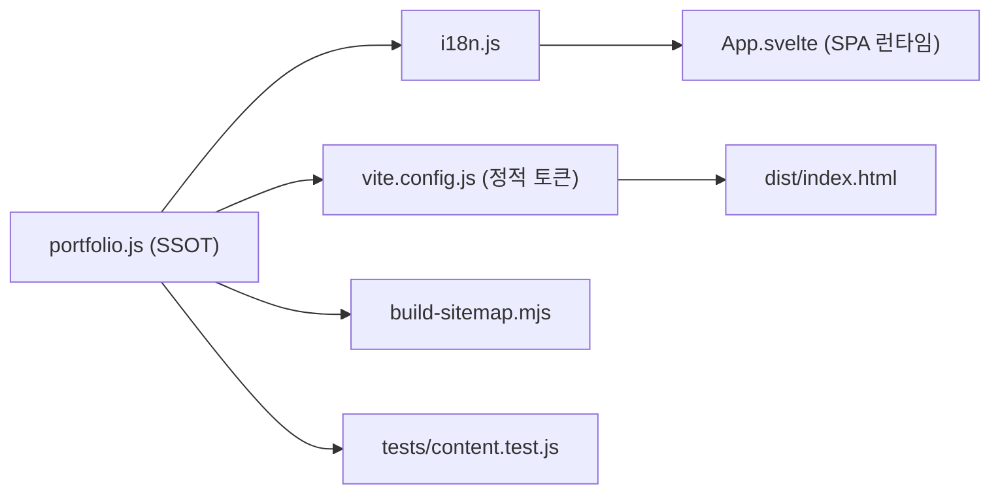

# 아키텍처

Svelte 5 + Vite 8 기반 정적 SPA입니다. 프레임워크 라우터나 상태 관리 라이브러리 없이
브라우저 히스토리와 콘텐츠 객체만으로 동작합니다.

## 콘텐츠 SSOT와 데이터 파이프라인

`src/content/portfolio.js`가 모든 편집 가능 콘텐츠의 단일 원본(SSOT)이며, `src/content/i18n.js`가 영문 번역 계층을 담당합니다. 자세한 데이터 스키마 및 필수 필드 명세는 [콘텐츠 SSOT 스펙](content-spec.md)을 참고하세요.

- `portfolio`: 사이트 문구, 내비게이션, 프로필, 스킬, 경력, 교육, 프로젝트 상세, 404 문구
- `siteMetadata`: `<head>` 주입에 쓰는 타이틀·설명·OG 값과 프로덕션 URL
- `homeJsonLd` / `projectJsonLd()`: 검색 엔진용 구조화 데이터 생성 함수
- `normalizePathname()`, `findPublishedProjectByPath()`, `collectSitePaths()`:
  라우팅, sitemap 생성, 테스트가 공유하는 경로 유틸리티
- `getPortfolio(locale)`: 로케일(`ko` / `en`)에 따라 번역된 콘텐츠 객체를 반환하는 팩토리 함수

프로젝트 노출은 `projects` 배열의 `published` 플래그로 제어합니다. `published !== true`인
프로젝트는 라우팅 조회와 sitemap에서 모두 제외됩니다.



## 라우팅

`src/App.svelte`가 라우터를 겸합니다.

- `pathname` 상태를 기준으로 홈 / 프로젝트 상세 / 404를 분기합니다.
- 문서 레벨 클릭 위임으로 내부 링크를 가로채 `history.pushState`로 전환합니다.
  외부 링크, `target="_blank"`, 다운로드 링크, 수정키 클릭은 기본 동작을 유지합니다.
- `popstate`(뒤로/앞으로가기)에서 pathname을 복원하고, 경로별 저장한
  `scrollPositions` 값으로 스크롤을 되돌립니다. 새 경로 진입은 상단으로 이동합니다.
- 앵커 링크는 같은 경로면 `scrollIntoView`만 수행하고, 다른 경로면 라우팅 후
  `tick()` 뒤에 스크롤합니다. `prefers-reduced-motion`이면 즉시 이동합니다.
- 서버(nginx)는 모든 비파일 요청을 `index.html`로 폴백하므로 직접 URL 진입도 동작합니다.

## 테마

라이트/다크 테마를 `document.documentElement.dataset.theme`으로 전환합니다.
저장소는 `localStorage`(`portfolio-theme`), 초기값은 저장값 또는
`prefers-color-scheme`입니다.

## 메타 주입 파이프라인

`<head>` 메타는 두 경로로 만들어집니다.

1. **빌드 시**: `index.html`의 `__TOKEN__` 플레이스홀더를 `vite.config.js`의
   `contentMetadataPlugin`이 `siteMetadata` 값으로 치환합니다. 크롤러와 직접 진입이
   보는 기본 메타입니다. 홈 JSON-LD도 이때 주입됩니다(`id="jsonld-home"`).
2. **런타임**: `App.svelte`의 `applyRouteMeta()`가 라우트 변경 시 description,
   OG/Twitter 태그, canonical, JSON-LD를 갱신합니다. 상세는
   [SEO와 메타데이터](seo.md) 참고.

## 디렉터리 역할

```
src/
  content/portfolio.js   콘텐츠 SSOT
  App.svelte             라우터 + 테마 + 메타
  pages/                 홈 · 프로젝트 상세 · 404
  components/            카드 · 헤더 · 다이어그램 등 반복 UI
  styles/                tokens · base · 화면별 · 반응형 CSS
scripts/                 빌드 후처리 (sitemap · worker · dist 검증)
deploy/                  Dockerfile · nginx 설정
ops/server/              서버 백업·모니터링 systemd 유닛
tests/                   콘텐츠 무결성 테스트
```
