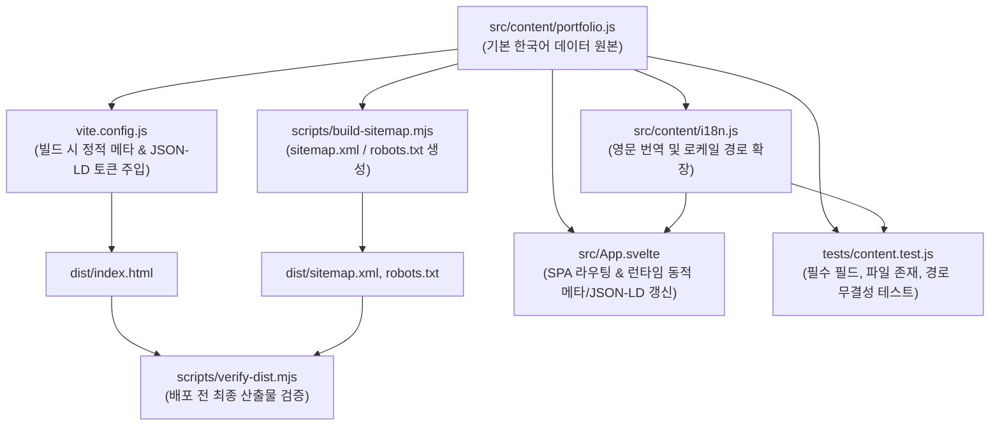

# 콘텐츠 SSOT 스펙 (`content-spec.md`)

이 문서는 포트폴리오 웹사이트의 유일한 데이터 원본인 `src/content/portfolio.js`와 다국어 변환 계층 `src/content/i18n.js`의 데이터 모델 및 스키마 명세를 정의합니다.

모든 사이트 문구, 프로필, 프로젝트 상세 내용, 메타데이터, sitemap, JSON-LD 구조화 데이터는 이 명세를 기준으로 생성 및 검증됩니다.

### 문구 작성 기준

- 제작 과정은 기술 목록보다 구체적인 작업을 설명합니다. 어떤 데이터·상태를 다뤘는지, 구현 방식과 선택의 비용, 확인 방법과 남은 한계를 적습니다.
- 근거 없는 장애 경험, 성능 개선 수치, 개발 기간, 사용자 반응을 서사에 추가하지 않습니다. 기존 기록의 테스트 결과는 해당 시점의 결과임을 표시합니다.
- AI 도구 사용은 숨기지 않고 초안·반복 작업·오류 분석의 역할과 검토 범위를 구분합니다. 제품의 RAG 처리 단계와 개발 도구 사용 기록도 혼동하지 않습니다.
- 제작 과정의 긴 영문 문단은 `englishProjects`에서 명시적으로 관리합니다. 한국어 문장 일치에 의존하는 `phraseMap`에 새 제작 과정 문단을 넣지 않습니다.
- TECHZONE의 CASE_STUDY, QuakeCurrent의 DECISIONS·ARCHITECTURE, Signal Archive의 README·RAG·DATA_PIPELINE, ERP의 v1 검증 기록과 v2 공장 업무 흐름, SummerGear의 테스트 배포 기록을 설명 근거로 사용합니다. 소스가 확인되지 않은 과거 프로젝트는 기존 범위 주장을 보수적으로 유지하고 새 incident를 만들지 않습니다.

- 01 섹션의 프로젝트는 학습·포트폴리오용 개인 프로젝트이며, 04 섹션의 실무 참여 경험과 구분합니다.
- 소개는 웹·앱 개발 경험과 개인 프로젝트를 통한 학습 방향을 중심으로 작성합니다. 특정 프로젝트의 도메인을 개발자 전체의 전문 분야처럼 표현하지 않습니다.
- 홈의 프로젝트 설명과 상세 페이지 도입부에 개인 프로젝트임을 표시하고, 구현 내용·테스트 결과·한계를 구체적으로 기록합니다.
- 공개 데모와 테스트 통과는 실제 고객 사용, 상용 운영 성과나 운영 부하 검증을 뜻하지 않습니다.
- 한국어와 영어에 같은 기준을 적용합니다. ERP의 언어별 상세 데이터는 `src/content/erp.js`에서 관리합니다.
- SummerGear(`socialapp`)는 `src/content/summergear.js`에서 관리합니다. 공개 테스트 데모와 실서비스를 구분하고, 거래 코드의 작업 중 상태와 OAuth·모바일·외부 서비스 검증 한계를 유지합니다.
- SummerGear 소개는 원본 저장소의 README, 이미지 계약, API 등록 코드, 모바일 WebView 코드와 2026-09-23 테스트 배포 기록을 대조했습니다. 이미지는 `sg.jisung.lol`의 홈·매물 상세를 읽기 전용으로 캡처했으며 테스트 상품·임시 이미지를 실제 고객 데이터로 표현하지 않습니다.

---

## 1. SSOT 아키텍처 흐름



---

## 2. 기본 데이터 스키마 (`portfolio` 객체)

### 2.1. 사이트 설정 (`portfolio.site`)
전역 사이트 환경 설정 및 기본 메타데이터 정의 객체입니다.

| 필드 | 타입 | 설명 | 예시 |
| --- | --- | --- | --- |
| `url` | `string` | 사이트 프로덕션 기준 도메인 URL (Trailing slash 없음) | `'https://bio.jisung.lol'` |
| `title` | `string` | 사이트 기본 타이틀 | `'개발자 포트폴리오'` |
| `systemLabel` | `string` | 시스템 헤더 라벨 | `'PORTFOLIO SYSTEM / 2026'` |
| `status` | `string` | 구직/활동 상태 배지 문구 | `'OPEN TO WORK'` |
| `description` | `string` | 사이트 기본 SEO 설명문구 | `'React와 Next.js 실무 경험을 바탕으로...'` |
| `socialDescription` | `string` | SNS 공유용 간략 설명 | `'화면의 완성도와 시스템의 흐름을 함께 설계합니다.'` |
| `socialTech` | `string` | SNS/Twitter 서브텍스트 기술 스택 | `'React · Next.js · NestJS · FastAPI'` |
| `socialImage` | `string` | 기본 OG 이미지 상대 경로 | `'/og.png'` |
| `locale` | `string` | 기본 언어 코드 | `'ko_KR'` |
| `themeColor` | `string` | 브라우저 테마 색상 헥스코드 | `'#fdfdfd'` |
| `footer` | `string` | 푸터 저작권 및 캡션 | `'DESIGNED & BUILT AS A FULL-STACK...'` |
| `navigation` | `Array<{label, href}>` | 상단 내비게이션 메뉴 목록 (해시 앵커) | `[{ label: 'ABOUT', href: '#about' }]` |
| `labels` | `Record<string, string>` | 웹 접근성(Aria), 테마 전환 등 UI 라벨 모음 | `{ skipLink: '...', lightTheme: '...' }` |

### 2.2. 프로필 (`portfolio.profile`)
메인 홈 화면 상단에 렌더링되는 개발자 소개 정보입니다.

- `position`: 대표 직무 타이틀 (`string`)
- `positionLines`: 타이틀 줄바꿈 렌더링용 배열 (`string[]`)
- `kicker`: 상단 키커 태그라인 (`string`)
- `intro`: 본문 요약 인트로 (`string`)
- `github`: 깃허브 프로필 URL (`string`)
- `actions`: 행동 유도 버튼 텍스트 객체 (`{ project, github }`)
- `proof`: 경력/경험 수치 요약 배열 (`Array<{ value: string, label: string }>`)
- `about`: 상세 소개 문단 배열 (`string[]`)
- `workflow`: 홈에서 보여주는 반복 개발 방식 (`{ label, note, steps }`)
  - `steps`: `Prototype → Plan → Autopilot → Review` 순서의 배열
  - 각 단계는 `title`, `description`, 실제 사례를 설명하는 `evidence`, 공개 프로젝트를 가리키는 `projectSlug`를 가집니다.

### 2.3. 스킬 및 섹션 (`portfolio.skills`, `portfolio.sections`)
- `sections`: 각 섹션 번호, 타이틀, 서머리 문구 관리 객체
  - `project.summary`: 개인 프로젝트의 목적을 알리는 항상 표시되는 설명
  - `project.note`: 프로젝트 갤러리 하단의 보조 설명
- `skills`: 스킬 그룹 배열 (`Array<{ id, kicker, title, items: string[] }>`)
  - 각 스킬 카테고리(Frontend, Backend, Data & Messaging, DevOps & Quality) 정의

#### 필수 필드 명세 (CI 및 테스트 검증 대상)
새 프로젝트를 추가하거나 수정할 때 아래 필드는 반드시 작성되어야 하며 `tests/content.test.js`에서 자동으로 누락 여부를 검증합니다.

| 필수 필드 | 타입 | 설명 | 필수 조건 / 제약 |
| --- | --- | --- | --- |
| `title` | `string` | 프로젝트 명칭 | 빈 문자열 불가 |
| `slug` | `string` | 라우트 URL 식별자 (`/projects/{slug}`) | 공백 없는 영문 소문자/하이픈 |
| `summary` | `string` | 프로젝트 핵심 요약 문구 | 메타 설명(description)으로 활용 |
| `cover` | `string` | 대표 썸네일 이미지 상대 경로 | `public/` 디렉터리에 실제 파일 존재 필수 |
| `coverAlt` | `string` | 대표 이미지 대체 텍스트 | 웹 접근성 및 SEO 준수 |
| `screenshots` | `Array<Screenshot>` | 상세 시각 자료 목록 | 최소 1개 이상 필수, 파일 실존 필수 |
| `liveUrl` | `string?` | 실제 공개 데모 URL | 검증된 배포가 있을 때만 작성; 미배포 프로젝트는 생략 |
| `repositoryUrl` | `string?` | 공개 코드 저장소 URL | 원격 저장소와 공개 상태를 확인할 수 있을 때만 작성; 없으면 생략 |

`liveUrl`과 `repositoryUrl`은 선택 필드입니다. 준비 예정, 로컬 전용, 공개 여부를 확인할 수 없는 저장소에는 가짜 링크를 넣지 않습니다. 상세 및 홈 화면은 값이 존재할 때만 링크를 렌더링합니다.

#### 필수 8개 케이스 섹션
모든 공개 프로젝트는 한국어와 영어 모두에서 다음 의미 있는 내용을 제공해야 합니다. 상세 라벨은 각 프로젝트의 `detail` 객체에서 명시적으로 번역합니다.

1. Introduction: 프로젝트 소개 (`summary`와 hero)
2. Problem: 해결하려는 문제 (`problem`)
3. Role & Work: 역할 및 구현 범위 (`role.summary`, `role.items`)
4. Stack: 사용 기술 (`stack`)
5. Process: 실제 구현 과정 (`process`)
6. Technical Decisions: 기술적 선택의 배경·결정·영향 (`decisions`)
7. Troubleshooting: 확인된 문제/실패 시나리오, 원인, 해결 (`troubleshooting`)
8. Outcome & Learnings: 결과, 배움, 한계 (`outcome`)

테스트 배포 기록과 재현 가능한 검증 시나리오는 운영 중 실제 incident와 구분해 기술합니다. 실제 장애를 경험했다고 주장할 근거가 없으면 troubleshooting 항목을 검증한 실패/복구 시나리오로 표현합니다.

#### `Screenshot` 객체 명세
```typescript
interface Screenshot {
  src: string;      // 예: '/techzone/storefront-home.png' (public/ 아래 실존 필수)
  alt: string;      // 이미지 대체 텍스트
  caption: string;  // 화면 하단 설명 캡션
  width: number;    // 원본 이미지 가로 해상도
  height: number;   // 원본 이미지 세로 해상도
  displayWidth?: number; // 모바일 캡처를 과도하게 확대하지 않는 최대 표시 너비(px)
}
```

실제 화면을 캡처하지 않은 경우 screenshots에는 UI처럼 보이는 가짜 mock을 넣지 않습니다. 소스 근거의 SVG 아키텍처/흐름도를 사용할 수 있으며 캡션에 반드시 “다이어그램, UI 캡처 아님”을 표시합니다. 실제 스크린샷과 설계도는 alt 및 caption에서도 구분합니다.

#### 케이스 스터디 상세 필드 (`detail` 및 옵션 필드)

- `gallery` (`object`): 홈 갤러리의 한 줄 설명(`tagline`), 짧은 요약(`summary`), 대표 장면(`image`, `alt`, `caption`, 선택적 `position`). 한국어·영어의 모든 공개 프로젝트에 작성합니다.
- `published` (`boolean`): 공개 여부 (`true`일 때만 라우팅 등록, 사이트맵 포함, 카드 노출)
- `status` (`string`): 상태 배지 문구
- `category` (`string`): 프로젝트 카테고리 분류
- `cardBadge` (`string`): 카드 하단 특화 배지 문구
- `caseStudyLabel` (`string`): 상세 보기 버튼 문구
- `problem` (`string`): 문제 정의 본문
- `role` (`{ summary: string, items: string[] }`): 담당 역할과 수행 범위
- `stack` (`string[]`): 기술 스택 태그
- `process` (`Array<{ step, title, description, outputs }>`): 개발 단계별 과정
- `decisions` (`Array<{ title, context, decision, impact }>`): 기술적 결정의 배경과 결과
- `troubleshooting` (`Array<{ title, problem, cause, solution }>`): 확인된 문제 또는 검증 시나리오와 대응
- `outcome` (`{ summary, results: string[], learnings: string[] }`): 결과·배움·한계
- `highlights` (`string[]`): 주요 구현 목록
- `validation` (`string[]`): 검증 및 품질 게이트 목록
- `detail` (`object`): 상세 페이지 렌더링용 라벨 및 Architecture/Topology/AI 확장

---

## 3. 다국어(i18n) 확장 규칙 (`src/content/i18n.js`)

포트폴리오는 한국어(`ko`)를 단일 기본 원본으로 유지하며, 영문(`en`)은 번역 매핑 계층을 통해 파생됩니다.

1. **단어/구문 매핑 (`phraseMap`)**:
   - `translateDeep` 함수가 프로젝트 객체 내부의 공통 섹션명, 다이어그램 라벨 등을 재귀적으로 치환합니다.
2. **프로젝트별 영문 오버라이드 (`englishProjects`)**:
   - 요약문(`summary`), 문제 정의(`problem`), 하이라이트 문장 등 문단 단위의 긴 텍스트는 인덱스별 명시적 객체 병합을 통해 완벽한 영문 텍스트로 치환됩니다.
3. **경로 및 로케일 유틸리티**:
   - `localeFromPath(pathname)`: `/en` 또는 `/en/...` 접두사 여부로 로케일 판별
   - `stripLocale(pathname)`: 내부 라우팅 조회를 위해 `/en` 제거
   - `localizedPath(path, locale)`: 로케일에 맞게 언어 접두사 부여 (`/projects/techzone` ➔ `/en/projects/techzone`)

---

## 4. 유효성 검증 규칙 및 품질 게이트

콘텐츠 수정 후 아래 규칙을 위반할 경우 빌드 또는 테스트 단계에서 즉시 실패합니다.

1. **URL 형식 검증**:
   - `portfolio.site.url`은 반드시 `https://bio.jisung.lol` 형태여야 함 (`tests/content.test.js`).
2. **미디어 자산 실존 검증**:
   - `project.cover`와 모든 `project.screenshots[].src` 파일은 프로젝트 루트의 `public/` 디렉터리에 실존해야 함.
3. **공개 상태 라우트 일치성**:
   - `collectSitePaths()`는 `published === true`인 프로젝트만 수집하며, `/en` 접두사 경로도 함께 산출물에 반영됨.
   - `published !== true`인 프로젝트는 비공개 처리되어 라우트 검색(`findPublishedProjectByPath`)에서 `undefined`를 반환해야 함.
4. **빌드 토큰 잔존 검증**:
   - 빌드 후 `dist/index.html`에 `__`로 둘러싸인 미치환 토큰이 남아있으면 `verify-dist.mjs`에 의해 빌드가 차단됨.
