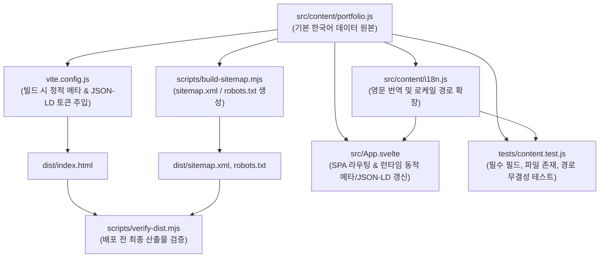

# 콘텐츠 SSOT 스펙 (`content-spec.md`)

이 문서는 포트폴리오 웹사이트의 유일한 데이터 원본인 `src/content/portfolio.js`와 다국어 변환 계층 `src/content/i18n.js`의 데이터 모델 및 스키마 명세를 정의합니다.

모든 사이트 문구, 프로필, 프로젝트 상세 내용, 메타데이터, sitemap, JSON-LD 구조화 데이터는 이 명세를 기준으로 생성 및 검증됩니다.

---

## 1. SSOT 아키텍처 흐름



---

## 2. 기본 데이터 스키마 (`portfolio` 객체)

### 2.1. 사이트 설정 (`portfolio.site`)
전역 사이트 환경 설정 및 기본 메타데이터 정의 객체입니다.

| 필드 | 타입 | 설명 | 예시 |
| --- | --- | --- | --- |
| `url` | `string` | 사이트 프로덕션 기준 도메인 URL (Trailing slash 없음) | `'https://bio.jisung.lol'` |
| `title` | `string` | 사이트 기본 타이틀 | `'개발자 포트폴리오'` |
| `systemLabel` | `string` | 시스템 헤더 라벨 | `'PORTFOLIO SYSTEM / 2026'` |
| `status` | `string` | 구직/활동 상태 배지 문구 | `'OPEN TO WORK'` |
| `description` | `string` | 사이트 기본 SEO 설명문구 | `'React와 Next.js 실무 경험을 바탕으로...'` |
| `socialDescription` | `string` | SNS 공유용 간략 설명 | `'화면의 완성도와 시스템의 흐름을 함께 설계합니다.'` |
| `socialTech` | `string` | SNS/Twitter 서브텍스트 기술 스택 | `'React · Next.js · NestJS · FastAPI'` |
| `socialImage` | `string` | 기본 OG 이미지 상대 경로 | `'/og.png'` |
| `locale` | `string` | 기본 언어 코드 | `'ko_KR'` |
| `themeColor` | `string` | 브라우저 테마 색상 헥스코드 | `'#fdfdfd'` |
| `footer` | `string` | 푸터 저작권 및 캡션 | `'DESIGNED & BUILT AS A FULL-STACK...'` |
| `navigation` | `Array<{label, href}>` | 상단 내비게이션 메뉴 목록 (해시 앵커) | `[{ label: 'ABOUT', href: '#about' }]` |
| `labels` | `Record<string, string>` | 웹 접근성(Aria), 테마 전환 등 UI 라벨 모음 | `{ skipLink: '...', lightTheme: '...' }` |

### 2.2. 프로필 (`portfolio.profile`)
메인 홈 화면 상단에 렌더링되는 개발자 소개 정보입니다.

- `position`: 대표 직무 타이틀 (`string`)
- `positionLines`: 타이틀 줄바꿈 렌더링용 배열 (`string[]`)
- `kicker`: 상단 키커 태그라인 (`string`)
- `intro`: 본문 요약 인트로 (`string`)
- `github`: 깃허브 프로필 URL (`string`)
- `actions`: 행동 유도 버튼 텍스트 객체 (`{ project, github }`)
- `proof`: 경력/경험 수치 요약 배열 (`Array<{ value: string, label: string }>`)
- `about`: 상세 소개 문단 배열 (`string[]`)
- `principles`: 핵심 엔지니어링 원칙 배열 (`Array<{ title: string, description: string }>`)

### 2.3. 스킬 및 섹션 (`portfolio.skills`, `portfolio.sections`)
- `sections`: 각 섹션 번호, 타이틀, 서머리 문구 관리 객체
- `skills`: 스킬 그룹 배열 (`Array<{ id, kicker, title, items: string[] }>`)
  - 각 스킬 카테고리(Frontend, Backend, Data & Messaging, DevOps & Quality) 정의

### 2.4. 프로젝트 상세 (`portfolio.projects[]`)
개별 포트폴리오 프로젝트의 전체 메타데이터 및 상세 케이스 스터디 내용입니다.

#### 필수 필드 명세 (CI 및 테스트 검증 대상)
새 프로젝트를 추가하거나 수정할 때 아래 8개 필드는 **반드시 작성**되어야 하며 `tests/content.test.js`에서 자동으로 누락 여부를 검증합니다.

| 필수 필드 | 타입 | 설명 | 필수 조건 / 제약 |
| --- | --- | --- | --- |
| `title` | `string` | 프로젝트 명칭 | 빈 문자열 불가 |
| `slug` | `string` | 라우트 URL 식별자 (`/projects/{slug}`) | 공백 없는 영문 소문자/하이픈 |
| `summary` | `string` | 프로젝트 핵심 요약 문구 | 메타 설명(description)으로 활용 |
| `cover` | `string` | 대표 썸네일 이미지 상대 경로 | `public/` 디렉터리에 실제 파일 존재 필수 |
| `coverAlt` | `string` | 대표 이미지 대체 텍스트 | 웹 접근성 및 SEO 준수 |
| `liveUrl` | `string` | 실제 배포된 서비스 데모 URL | 프로덕션 접속 가능한 전체 URL |
| `repositoryUrl` | `string` | 소스코드 GitHub 저장소 URL | 접속 가능한 GitHub 전체 URL |
| `screenshots` | `Array<Screenshot>` | 상세 화면 스크린샷 목록 | 최소 1개 이상 필수, 파일 실존 필수 |

#### `Screenshot` 객체 명세
```typescript
interface Screenshot {
  src: string;      // 예: '/techzone/storefront-home.png' (public/ 아래 실존 필수)
  alt: string;      // 이미지 대체 텍스트
  caption: string;  // 화면 하단 설명 캡션
  width: number;    // 원본 이미지 가로 해상도
  height: number;   // 원본 이미지 세로 해상도
}
```

#### 케이스 스터디 상세 필드 (`detail` 및 옵션 필드)
- `published` (`boolean`): 공개 여부 (`true`일 때만 라우팅 등록, 사이트맵 포함, 카드 노출)
- `status` (`string`): 상태 배지 문구 (예: `'CASE STUDY · LIVE'`)
- `category` (`string`): 프로젝트 카테고리 분류
- `cardBadge` (`string`): 카드 하단 특화 배지 문구
- `caseStudyLabel` (`string`): 상세 보기 버튼 문구
- `problem` (`string`): 문제 정의 본문 요약
- `highlights` (`string[]`): 주요 구현 목록
- `validation` (`string[]`): 검증 및 품질 게이트 목록
- `detail` (`object`): 상세 페이지 렌더링용 확장 객체
  - `sections`: 상세 탭/섹션 라벨 및 제목
  - `metrics`: 주요 수치 성과 리스트
  - `problem`: 세부 문제 상황 문단 및 해결 방안
  - `architecture`: 아키텍처 다이어그램 데이터 및 설명 블록
  - `topology`: 시스템 토폴로지 다이어그램 데이터 및 레이어 정의
  - `process`: 개발 단계별 진행 과정
  - `build`: 기술적 난제 해결 및 핵심 코드 구현 설명
  - `ai`: AI 협업(도구 활용, 리뷰 및 검증) 기록
  - `validation`: 테스트, 복구 시나리오, 배포 파이프라인 증거

---

## 3. 다국어(i18n) 확장 규칙 (`src/content/i18n.js`)

포트폴리오는 한국어(`ko`)를 단일 기본 원본으로 유지하며, 영문(`en`)은 번역 매핑 계층을 통해 파생됩니다.

1. **단어/구문 매핑 (`phraseMap`)**:
   - `translateDeep` 함수가 프로젝트 객체 내부의 공통 섹션명, 다이어그램 라벨 등을 재귀적으로 치환합니다.
2. **프로젝트별 영문 오버라이드 (`englishProjects`)**:
   - 요약문(`summary`), 문제 정의(`problem`), 하이라이트 문장 등 문단 단위의 긴 텍스트는 인덱스별 명시적 객체 병합을 통해 완벽한 영문 텍스트로 치환됩니다.
3. **경로 및 로케일 유틸리티**:
   - `localeFromPath(pathname)`: `/en` 또는 `/en/...` 접두사 여부로 로케일 판별
   - `stripLocale(pathname)`: 내부 라우팅 조회를 위해 `/en` 제거
   - `localizedPath(path, locale)`: 로케일에 맞게 언어 접두사 부여 (`/projects/techzone` ➔ `/en/projects/techzone`)

---

## 4. 유효성 검증 규칙 및 품질 게이트

콘텐츠 수정 후 아래 규칙을 위반할 경우 빌드 또는 테스트 단계에서 즉시 실패합니다.

1. **URL 형식 검증**:
   - `portfolio.site.url`은 반드시 `https://bio.jisung.lol` 형태여야 함 (`tests/content.test.js`).
2. **미디어 자산 실존 검증**:
   - `project.cover`와 모든 `project.screenshots[].src` 파일은 프로젝트 루트의 `public/` 디렉터리에 실존해야 함.
3. **공개 상태 라우트 일치성**:
   - `collectSitePaths()`는 `published === true`인 프로젝트만 수집하며, `/en` 접두사 경로도 함께 산출물에 반영됨.
   - `published !== true`인 프로젝트는 비공개 처리되어 라우트 검색(`findPublishedProjectByPath`)에서 `undefined`를 반환해야 함.
4. **빌드 토큰 잔존 검증**:
   - 빌드 후 `dist/index.html`에 `__`로 둘러싸인 미치환 토큰이 남아있으면 `verify-dist.mjs`에 의해 빌드가 차단됨.
